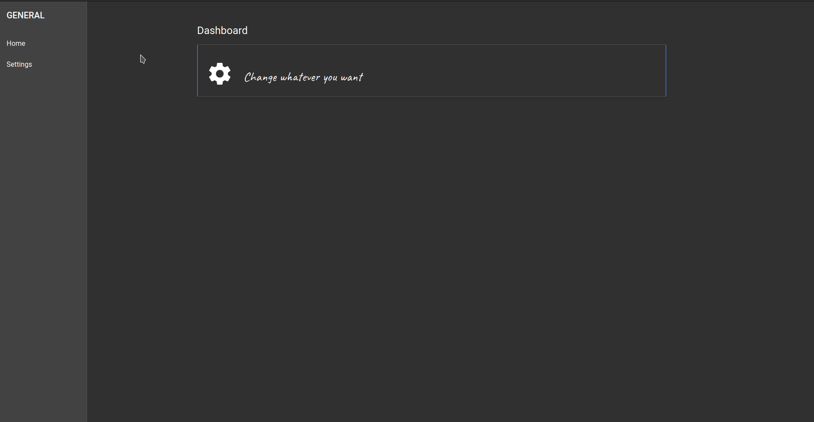

# Presence

The current application was developed in order to accomplish tasks and obligations in everyday life as easily, quickly and efficiently as possible.

The range of functions therefore goes from the simple creation of a task, through personal time recording to the presentation and analysis of data from the fitness sector. If necessary, this information is provided by means of appropriate visualization options.

The name of the app is derived from the fact that the user should be present and arrive in the present, is aware of his obligations and gradually fulfils them with care.

<br>

Note on the project

- The technology stack moves only in the areas of `Typescript, HTML, SCSS`. Other technologies were deliberately not used in the current system.
- Since this is a pure hobby project of mine, commit messages and the code quality were not always put into focus by me - this lies mainly in the generation of new functions.
  - If, on the other hand, I work professionally in a project, then the code quality and a strong project team are in the foreground, where everyone contributes his or her share for the common higher goal.
  - Since I work alone on this project, there is only the master branch. If, on the other hand, I were to argue together in a team, the standardized git workflow with release and feature branches is of course to be preferred.

<br>

# Installation Guide

1. Install npm

```
Available for linux, windows, mac...
```

2. Install Angular

```
npm install -g @angular/cli
```

3. Install json-server

```
npm install -g json-server
```

4. Clone the project to your local directory

```
git clone https://github.com/maxjaen/angular-webapp-todo.git
```

5. Install dependencies in directory

```
npm install
```

<br>

# Usage

The development server and the JSON server have be executed in separate terminals at the same time.

<br>

## Development server

- Run `ng serve -open` or `ng serve --open --port 4401` (specific port) for a dev server. Navigate to `http://localhost:4200/`. The app will automatically reload if you change any of the source files.

<br>

## JSON Server

- Run `json-server --watch server/example.json` for a json server. Navigate to `http://localhost:3000/`.

<br>

# Showcase


